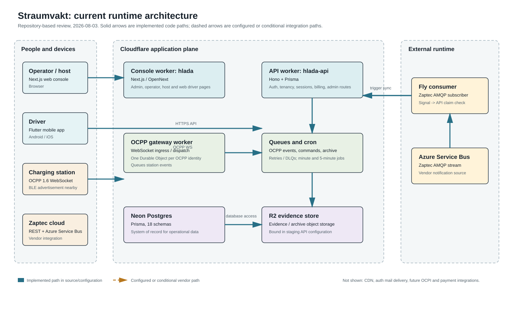
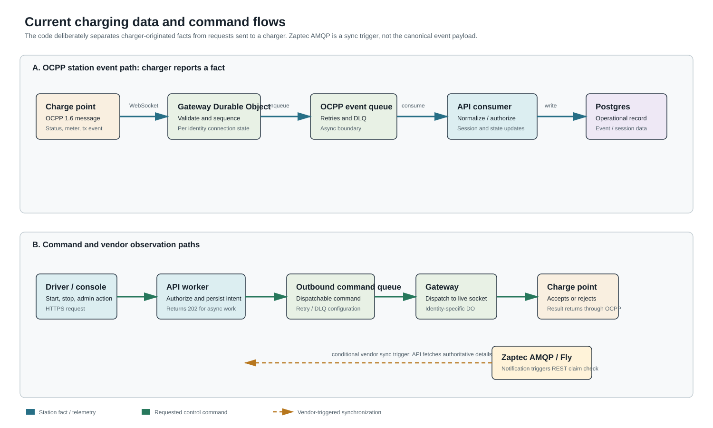
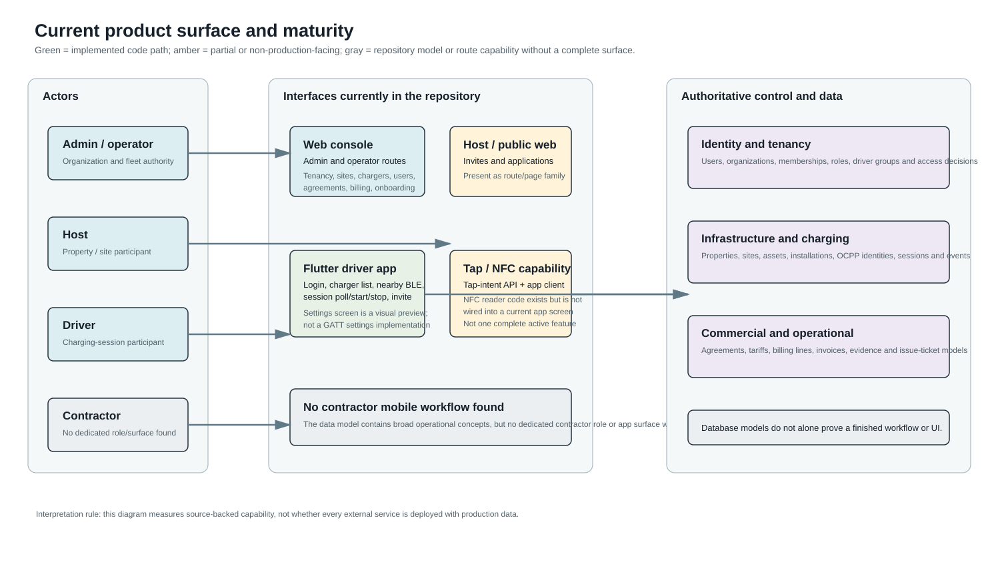

# Straumvakt: Current Project Function Report

**Review date:** 2026-08-03  
**Method:** Source and configuration review of `E:\Claude\Straumvakt`. This is an implementation report, not a roadmap. A component is called *implemented* when its source and configuration exist; that does not prove that it is deployed, provisioned with production data, or operating against real charge points.

## Executive summary

Straumvakt is already a multi-service charging-platform codebase, rather than a single app. Its present architecture has four working-shaped runtime planes:

1. A Next.js web console for administrative and operational work.
2. A Hono/Cloudflare Worker API that holds authentication, tenancy, charger, session, agreement, billing and integration routes.
3. A separate OCPP 1.6 gateway Worker with a Durable Object per charger identity and queue-based event delivery.
4. A Flutter driver app backed by the staging API, with login, entitled charger discovery, BLE advertisement scanning, driver-session endpoints and an emerging tap-intent flow.

The system of record is a multischema Postgres database accessed through Prisma. Cloudflare Queues separate charger event ingestion and outgoing commands from request handling. Zaptec has a second, vendor-specific observation path: a Fly-hosted Azure Service Bus consumer treats AMQP messages as signals and asks the API to fetch authoritative details from Zaptec.

The foundation is materially further along than a mockup, but the product is uneven. The backend and data model anticipate agreements, billing, issues, host onboarding, driver groups and multi-operator tenancy. Some of those areas have routes and repositories; others are not yet demonstrated as a complete, user-facing workflow. The current Flutter charger-settings screens are visual previews only: there is no source-backed BLE GATT settings implementation in the app.

## What exists now

| Area | Source-backed state | What it means in practice |
| --- | --- | --- |
| Web console | Implemented | Next.js/OpenNext app in `src/`, with broad admin/operator/host page and API-route coverage. |
| API/control plane | Implemented | `apps/api` is a Hono Worker using Prisma/Neon and route families for admin, public, driver and internal integrations. |
| OCPP ingress | Implemented | `gateway` accepts authenticated OCPP 1.6 WebSockets and owns live connection state per OCPP identity through Durable Objects. |
| Charger event processing | Implemented | Gateway sends events through an OCPP queue; API consumers normalize and persist them. |
| Outbound charger control | Implemented-shaped | API accepts asynchronous operations such as session start/stop and has an outbound command queue and gateway dispatch path. Actual delivery still depends on a connected, correctly configured charge point. |
| Zaptec integration | Implemented-shaped | API vendor routes, scheduled sync and a Fly AMQP consumer exist. AMQP is a trigger, not the authoritative charging payload. |
| Driver mobile app | Partly implemented | Flutter app talks to staging API; login, charger list, BLE scan, invite redemption and session APIs exist. Completeness and production readiness need validation. |
| BLE charger settings | Not implemented as operation | Hardware guide and a visual preview exist, but no Flutter GATT connection/discovery/read/write/verification client was found. |
| NFC / tap | Partial and split | Newer tap-intent API/app client exists. Older NFC phone-reader code also exists but is not wired into a current screen and is a different interaction model. |
| Contractor experience | Not found | No dedicated contractor role, mobile app, or workflow surface was found in the reviewed source. |
| Issue engine | Model and some supporting code | `IssueTicket` exists in the schema; this review did not establish a complete detection, triage and contractor-resolution product flow. |

## Runtime architecture

### 1. Web console

The root application is a Next.js 16/React app in `src/`, packaged for Cloudflare using OpenNext. The root Worker is called `hlada` (`hlada-staging` for staging). It contains the operational web experience: technical reads, chargers, sessions, users, sites, vehicle identifiers, agreements, billing and onboarding-related screens/routes.

It is separate from the direct API Worker. In staging its configured API base is `https://hlada-api-staging.straumvakt.workers.dev`. The root configuration explicitly notes that the production direct API Worker has not yet been deployed. This matters: a built UI and a complete API source tree do not by themselves demonstrate a completed production cutover.

### 2. API/control plane

`apps/api` is the main business API. It is a Hono application deployed as a Cloudflare Worker. It mounts route families for:

- **Admin:** authentication, organizations, properties, sites, installations, circuits, users, memberships, chargers, vehicles, active sessions, onboarding, vendor credentials, groups, tokens, agreements, billing, contracts, host applications and access requests.
- **Public:** invites, host applications, registration, email verification and password reset.
- **Driver:** login, profile, entitled chargers, sessions, start/stop commands, access requests and tap intent.
- **Internal:** OCPP authorization, OCPP event ingestion, command/gateway support, Zaptec synchronization and state events.

The Worker has rate-limit bindings for login and uses scheduled jobs. The source describes minute-level session work and 5-minute vendor/status synchronization. The schedules are real configuration; the business outcome still depends on credentials, bindings and data being present in the deployed environment.

### 3. OCPP gateway

`gateway` is intentionally separate from the API. A charge point opens an authenticated OCPP 1.6 WebSocket at `/ocpp/:identityString` (or `/ocpp/1.6/:identityString`). The gateway creates or addresses one Cloudflare Durable Object for each `ocpp_identities.id`.

This gives each physical OCPP identity a single owner for its live socket and connection state. Station-originated OCPP messages go to the gateway, then to the OCPP event queue, then to API consumers. This makes event processing retryable and prevents the HTTP API request path from becoming the charger socket owner.

The gateway also exposes internal dispatch/invalidation endpoints. API-side command work can use those paths to reach the live charger connection. That is the correct separation: a driver or operator asks the API for an outcome; the API authorizes and persists intent; the gateway delivers an OCPP command if the station is connected.

### 4. Database and evidence

`prisma/schema.prisma` uses 18 Postgres schemas, including identity, tenancy, hosts, properties, assets, hardware, OCPP, charging, billing, issues, events, audit, entitlements, people, vendors, roaming, energy and webhooks.

Key records include users, organizations, memberships, properties/sites/assets/installations, charging stations, OCPP identities, charge sessions, billing transactions, agreements and clauses, driver groups and memberships, event/audit records, and issue tickets. Money is modeled in minor units. This is a broad domain foundation for a multi-operator system.

The API Worker binds an R2 evidence bucket in staging and has archive queues/jobs. The report does not treat that as evidence that a full evidence-management UI or retention operation has been commissioned.

### 5. Zaptec observation and synchronization

`apps/zaptec-consumer` is a Node service deployed on Fly. It reads Zaptec Azure Service Bus AMQP messages and can debounce them before POSTing to the API's internal Zaptec-trigger endpoint. The API then uses the vendor integration to perform the authoritative detail synchronization.

This is a deliberate claim-check pattern: the AMQP body is not trusted as the final domain event. It says, in effect, "Zaptec changed something; retrieve the current detail." It reduces coupling to vendor message shape, but it means real-time behavior depends on the consumer, the API's sync credentials and Zaptec REST availability.

## How the core charging loop works

1. An organization owns the operational scope. Memberships and roles decide which people can act inside it; sites, assets, installations and stations represent the physical estate.
2. A station is represented by an OCPP identity. When connected, its gateway Durable Object owns the socket.
3. The station emits OCPP status, authorization, meter and transaction facts. The gateway queues those facts; API consumers update operational records such as charger state and sessions.
4. A driver or operator makes a request through the app or console. For a control action, the API checks access, records/queues the requested work and returns an asynchronous response where appropriate.
5. The gateway attempts command dispatch to the station's live OCPP socket. The station's later OCPP messages are the evidence that the physical world accepted, rejected or completed that action.
6. Session, tariff/agreement and billing structures can turn the operational record into commercial records. The source has repositories and schema for this; a line in the database should not be confused with a proven end-to-end invoice or payment lifecycle.

### Why the queue boundary matters

Charger traffic is bursty and stateful. The queue makes the gateway resilient to short API/database failures and permits retry/dead-letter handling. Conversely, an API response of `202 Accepted` is not proof that charging has started or stopped; it says the control request has been accepted for asynchronous handling. The resulting station event is the meaningful confirmation.

## Identity, roles and access

The source makes organization tenancy a first-class design concern. Organizations, memberships and role-bound access exist alongside driver groups, driver-group memberships, user credentials and tokens. This is a sound basis for multiple operators because user identity is distinct from the operator/site context in which a person is allowed to act.

Current roles/surfaces are uneven:

- **Admin/operator:** strongest surface. The API and web tree contain broad administration of organizations, property hierarchy, chargers, users, groups, vendor credentials, agreements and billing.
- **Host:** present through host application, onboarding and invite-related route/page families. The exact completeness of the host-admin journey needs UI-level validation.
- **Driver:** present as a Flutter app plus driver API. It has the most clearly identified end-user mobile surface.
- **Contractor:** no dedicated actor surface was found. The data model can support operational work, but it is not a contractor application today.

## Driver app: what it actually does

The remaining Flutter app is `apps/mobile` (`straumvakt_app`). Its API client is pinned to the staging API. Source-backed capabilities include:

- Driver login and bearer-token API calls.
- Profile retrieval and locale preference update.
- Loading the driver's authorized/entitled chargers.
- Invite redemption, including QR-oriented entry points.
- Current session polling and start/stop session calls.
- BLE advertisement scanning using `flutter_blue_plus`, with matching against the driver's known charger serial or MAC identifiers.
- A debug-only fake-nearby mechanism because Android emulators do not provide real BLE scanning.
- A tap-intent client that arms an intent with the API for a selected charger.

The BLE scanner is **proximity discovery**, not charger configuration. It requests Bluetooth permissions, watches advertisements and exposes nearby known chargers. The reviewed source does not contain the full operational sequence required for settings: connect to a GATT peripheral, authenticate with a PIN, discover services/characteristics, read values, write a value, read back to verify and display a verified result.

### Tap and NFC are two different designs

The current source contains two distinct approaches which must not be merged conceptually:

1. **Tap-intent / charger-reader correlation:** The mobile client can arm a server-side intent identifying the driver and station. Comments and API flow describe the charger independently reporting a physical RFID-reader tap with an anonymous per-tap random UID; the server correlates station and time window. This is the newer model.
2. **Phone NFC reader mode:** `apps/mobile/lib/nfc/tap_reader.dart` puts the phone in reader mode so it reads an NFC tag. It is not wired into a current UI flow. It is the earlier tag-on-charger design and is not proof that phone-to-charger authentication is presently usable.

The first is partial infrastructure; the second is dormant source. Neither should be described as a finished, current user-facing "tap and authenticate" experience without an end-to-end test.

### Charger settings preview

The app currently contains a charger-settings preview and associated detail/connectivity preview screens. They are useful visual work, but they are not a device-control feature. Their values and buttons are not backed by the GATT workflow described in `docs/app/charger-settings-ui-guide.md`.

The hardware documentation is valuable: it records discovered Zaptec BLE characteristics, PIN risk, write-only Wi-Fi password behavior, verification requirements and RSSI presentation guidance. It should be treated as an implementation specification for future work, not evidence that arbitrary charger settings can be edited now.

## Billing, agreements and reporting

Straumvakt has a substantial commercial model in source:

- Agreements and agreement clauses.
- Agreement cost factors and billing lines.
- Billing transactions, billing period summaries and driver contracts.
- Tariff definitions, retailer/DSO-related references and session-ledger-style reconciliation.
- Zaptec CDR synchronization/reconciliation code and tests.

This means the project has stronger billing foundations than a simple charger dashboard. It does **not** prove that all billing responsibilities are operationally complete. In particular, this review did not establish a finished, customer-facing invoice delivery, payment collection, credit/refund, reconciliation exception, tax-document or finance-export workflow. Reporting screens may exist in the web app, but their business completeness needs separate acceptance testing with realistic tenant data.

## Issues, operations and support

The schema contains `IssueTicket` and the codebase contains issue-related architecture and go-live material. This establishes an intentional domain boundary for operational incidents. I did not find enough source evidence in this review to claim a complete issue engine that:

- Detects a charger/service anomaly from telemetry.
- Opens, deduplicates and prioritizes a ticket.
- Assigns it to an operator or contractor.
- Gives the assignee a mobile workflow, evidence upload and resolution actions.
- Closes the loop into customer communication and commercial adjustment.

That distinction is important for a 4,000-5,000 connector operation: issue records alone do not create the operational conveyor belt needed to resolve field faults at volume.

## Test and deployment confidence

The repository includes meaningful unit tests around gateway Durable Object/ingest behavior, OCPP event handling, driver sessions/pricing/access requests, group memberships and Zaptec session synchronization. That is a positive signal: the important boundaries are not wholly untested.

However, this review was static. It did not run a complete deployment, provision Cloudflare/Fly/Neon secrets, connect a live charger, or execute a production payment/billing cycle. The following must therefore be verified separately:

- Which Workers, Queues, R2 buckets, Hyperdrive bindings and Fly apps are live in each environment.
- Whether production API routing is complete; the root configuration currently comments that direct production API deployment is pending.
- Real OCPP station enrollment, TLS/authentication, reconnect behavior, command acknowledgements and queue recovery.
- Real Zaptec credential health and AMQP-to-REST synchronization timing.
- End-to-end driver authorization, session start/stop, settlement and invoice outcomes.
- Mobile app release configuration and device tests for Bluetooth, NFC, background behavior and permissions.

## Documentation drift and risks to manage

The codebase has excellent ADR and design coverage, but several documents describe intended scope, pilots or future architecture. They should not be used as the sole statement of what is live. Three practical rules follow:

1. Mark every capability as **implemented**, **partially implemented**, **preview**, or **planned** in product status material.
2. Treat the current Flutter `apps/mobile` tree as the physical app source presently in the repository, while auditing feature provenance carefully. In particular, do not treat the unhooked NFC reader as confirmation of the newer charger-reader correlation flow.
3. Keep the settings guide's safety rules when implementing GATT: foreground scanning, no PIN retry loop, write-only Wi-Fi password treatment, and read-back verification after writes.

## Plain-English conclusion

Straumvakt already has the bones of a real CPMS: multi-tenant data boundaries, an operator console, a real direct API, OCPP ingress that can scale connection ownership by identity, asynchronous queues, a vendor sync path and a driver app that talks to the platform.

Its next challenge is not inventing more domain nouns. It is closing the operational loops that turn those foundations into a complete service: verified charger control, a single finished driver journey, contractor/issue execution, billing and settlement acceptance tests, production deployment parity and a clear capability register. The architecture can support that work; the current source shows that several of the last-mile experiences are still partial or only specified.

## Evidence reviewed

- `package.json`, `wrangler.jsonc`, `apps/api/wrangler.jsonc` and `gateway/wrangler.jsonc`.
- `src/`, `apps/api/src/`, `gateway/src/`, `apps/zaptec-consumer/`, `apps/mobile/lib/` and `packages/shared/`.
- `prisma/schema.prisma` and associated migrations/repositories/tests.
- `docs/adr/`, `docs/architecture/`, `docs/app/charger-settings-ui-guide.md` and `docs/reference/integrations/zaptec-ble-protocol.md`.

