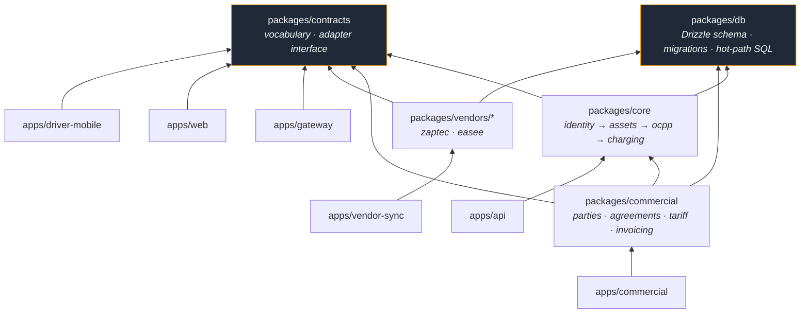

# ADR 0052 — Workspace and project split: substrate, packages, deployables

> **LEGACY — pre-market-focus historical reference. Not active canon. See /FOCUS.md. Load-bearing constraints extracted into the focus rules.**

**Status:** Proposed · 2026-08-07 · **documentation only — no code moved**
**Relates to:**
[ADR 0013](./0013-split-ui-api-do-queues.md) (five-tier topology),
[ADR 0018](./0018-data-platform-and-orm-boundary.md) (ORM boundary + hot path),
[ADR 0031](./0031-cost-model-and-money-flow.md) + its 2026-06-14 amendment
(agent posture, per-factor markup),
[ADR 0034](./0034-contractor-billing-and-tengill-org.md) (contractor as a
billable party),
[ADR 0045](./0045-electrical-topology-as-a-graph.md) (topology as a graph),
[ADR 0051](./0051-drizzle-owns-the-schema.md) (Drizzle owns the schema).
**Implements the structural half of**
[the target domain tree](../notes/2026-08-04-target-domain-tree.md).

---

## Framing — Straumvakt is a substrate, not a CPMS

Straumvakt is a **substrate** with vertical products on top:

| product | status | what it is |
|---|---|---|
| **Operate** | first to market | the CPMS |
| **Service** | separate dev group | contractor / Tengill (ADR 0034) |
| **Flex** | future | DER aggregation |

The substrate is three things and only three: **the event log**,
**identity/tenancy**, and **the party-based commercial-agreement engine**.

This is not a naming preference. It decides where code lives, who may edit
it, and what gets extracted later. "A CPMS with extras" produces a monolith
with feature flags; a substrate with verticals produces packages with owners.
The agreement engine in particular is substrate rather than Operate-specific
precisely because ADR 0034 already established a second money-flow direction
(platform → contractor) that has nothing to do with charging.

## Package layout

npm workspaces, one monorepo.

```
packages/contracts     canonical vocabulary — domain + OCPP event types, API
                       DTOs and client types, shared IDs and enums, the
                       vendor-adapter INTERFACE plus its conformance suite,
                       the issues-engine seam.
                       Publishable, semver'd (private registry) even while
                       in-monorepo; consumed via the workspace protocol.
                       Stable; few editors.

packages/db            Drizzle schema — single source of truth — plus
                       migrations (ADR 0051). THE SCHEMA IS THE ASSET; the
                       ORM is an accessor. The two Prisma schema mirrors
                       retire as the ~480-call port completes.

packages/core          substrate domain, vendor-free, layered exactly as the
                       existing depcruise rule already enforces:
                       identity → assets (incl. the circuit/topology graph)
                       → ocpp → charging

packages/commercial    parties · agreements · cost factors · cost centers ·
                       tariff engine · invoicing. Top of the chain.
                       The market crown jewel.

packages/vendors/*     zaptec, easee, … Adapters implementing the contracts
                       interface and owning VendorAssetRef.
                       Nothing in core or commercial imports these.
```

**Every substrate context is a PACKAGE, not a folder.** A group is already
building in parallel; a folder boundary is a suggestion, a package boundary
is enforced by the resolver.

## Deployables

```
apps/api             hot path — identity/assets/ocpp/charging.
                     Deliberately bundle-lean: Worker cold-start is a
                     latency budget, and ADR 0013 exists because bundling
                     went wrong once already.
apps/commercial      its OWN Worker + queue consumer. Different financial
                     cadence, different risk class.
apps/gateway         the generic OCPP engine. contracts-only dependencies.
apps/web             operator console — MOVED OUT of the repo root.
apps/driver-mobile   Flutter.
apps/vendor-sync     claim-check consumer over packages/vendors/*.
```

Root becomes **tooling-only**.

**Extraction rule.** A new deployable is justified only where the **scaling
profile**, the **risk profile**, or the **buyer** differs. That yields
gateway (scaling), commercial (risk), the vendor edge (blast radius) and,
later, Service (buyer). **The core hot path stays ONE Worker.** No premature
microservices — the split is along seams that already exist, not along
package boundaries for their own sake.

## Version control, release, governance

- **Monorepo + affected-graph CI** (Turborepo or Nx) + CODEOWNERS, so a push
  to one package builds and reviews only that package and its dependents.
  No shaking the whole tree for first-party teams.
- **The published-contracts boundary** is what makes later extraction a
  config change rather than a rewrite. **Service is the first split-out
  repo** — a different, possibly external group earns repo-level isolation.
- **Per-app, path-scoped Cloudflare deploys** replace the whole-tree trigger.
  See the hazard below.
- **Governance:** CODEOWNERS per package. The **Platform team gates `db` and
  `contracts`** — the two packages where a careless edit is felt everywhere.

### Rule 1 hazard — flagged, unresolved

Today a push to `master` rebuilds **everything**, because the Cloudflare
build trigger is repo-wide (CLAUDE.md §Deploy environments). Under this
split that becomes worse, not better: six deployables would rebuild on any
commit, and a `packages/web` typo could take the OCPP gateway down.

**Until per-app build watch paths are configured, the split increases
deploy blast radius.** Treat step 4's deploy-scoping exit criterion as a
Rule 1 gate, not a nice-to-have.

## Vendor conformance suite

`packages/contracts` owns the vendor-adapter **interface** and a
**conformance test suite** that any adapter must pass. This is the
mechanism that makes "scale beyond a single vendor" real rather than
aspirational: Easee is not a porting exercise, it is an implementation of a
tested interface.

The suite is the exit criterion for step 3. An adapter that passes it may be
swapped in; one that does not, may not.

## Go-to-market commercial MVP — flat fee as a degenerate agreement

**A flat single-connector platform fee, priced low for first-comers.**

Implemented as the **simplest valid Agreement on the real commercial
engine** — one cost factor, one rate reference, on a **Straumvakt ↔ host**
agreement. Consistent with ADR 0031 Q2.1, where Straumvakt's own revenue is
the Straumvakt → Host service fee and Straumvakt's posture is agent, not
principal.

**It is NOT a bypass and NOT a second billing path.**

Deferred, explicitly: driver attribution, DSO-by-address resolution,
retailer choice, workplace/home reimbursement.

First-comer pricing **must be re-priceable at renewal** — versioned and
time-boxed via the rate reference's effective window, not a hard-coded
number.

> **Rationale, stated plainly:** the first real invoice is the point of no
> return, and this project has already produced **three billing
> generations** (ADR 0048 measured them). A fourth — even a "temporary
> simple one" — would be the most expensive shortcut available. The flat fee
> is a *configuration* of the surviving engine, not an alternative to it.

**Rule 5 boundary:** this ADR describes the flat-fee *shape*. Writing its
math, its factor code, or its resolution order is a later, approval-gated
task.

---

## Reconciliation — four points where the brief and the record differ

Flagged rather than silently chosen, as instructed.

### R1. ADR 0025 is already resolved — the critical path is shorter

The brief states the commercial surface depends on "resolving ADR 0025
(billing cutover) → dissolving Installation."

**ADR 0025 was resolved on 2026-08-07 by
[ADR 0048](./0048-billing-cutover-resolved-agreements-survives.md)**, which
supersedes it: the agreements generation survives, legacy pricing retires.
The agreements ledger has since priced its first sessions.

What actually remains on that path:

1. **ADR 0048 step 2 — run CO-3**, the shadow comparison over the 1,621
   legacy ledger rows. Operator-run, Rule 5. Not started.
2. **[ADR 0047](./0047-dissolving-installation.md) — dissolving
   Installation.** Status Proposed; D1 answered, **D2/D3/D4 still open**.

So the gate on step 5 is **CO-3 + ADR 0047**, not ADR 0025.

### R2. The vendor leak count is 22, not 21

`.dependency-cruiser-known-violations.json` holds **24** entries:
**22 `no-import-from-vendor`**, 1 `no-circular`, 1
`no-identity-to-higher-layer`. Step 3's exit criterion is therefore
**22 → 0**, and the other two are out of its scope.

### R3. ADR 0031's role-derivation rule is already superseded

ADR 0031 §Stakeholder structure (2026-06-14) states *"role = which
`service_*` agreements it holds."* That makes a commercial fact determine an
identity fact — which the layering in this ADR forbids permanently, since
identity may never read commercial.

**Superseded 2026-08-07** (target-domain-tree note): roles are written by
Straumvakt admin. `tenancy.organizations.roles` is operator-maintained
state, not a projection. This ADR depends on that resolution holding — if
role derivation ever returns, `packages/core` gains a dependency on
`packages/commercial` and the layering collapses.

### R4. ADR 0018's hybrid ORM boundary survives and `packages/db` must carry it

ADR 0018 Decision 2 chose **hybrid**: ORM for the control plane, **raw SQL
for the hot ingest path**, with the drift-column trick and its
`SCHEMA_COLUMNS` discipline.

ADR 0051 replaced *which ORM*; it did not repeal the hybrid boundary.
`packages/db` therefore owns **both** the Drizzle declarations **and** the
raw-SQL hot path — otherwise the split quietly forces 400 events/sec through
an ORM that ADR 0018 measured as insufficient at 4k chargers.

*(Also noted, not a contradiction: ADR 0013 specified Cloudflare **Pages**
for UI. That tier never landed — the console runs as a Worker via OpenNext.
`apps/web` matches reality, not ADR 0013 as written.)*

---

## Target dependency graph



Read the arrows as "depends on". Two rules the graph encodes:

- **`vendors` is a sink.** Nothing in `core` or `commercial` points at it.
  The 22 baselined leaks are exactly the arrows this forbids.
- **`gateway` sees only `contracts`.** A generic OCPP engine that imports
  the domain is not generic.

Amber = Platform-gated (`db`, `contracts`).

---

## Sequence, with exit criteria

The package split (1–4) proceeds **in parallel** with the commercial
critical path and does not wait on it.

| # | Step | Exit criterion |
|---|---|---|
| **1** | `packages/db` — one Drizzle schema; retire the Prisma mirrors as the port completes | `check:schema-consistency` retired because there is nothing left to compare; `prisma/` and `apps/api/prisma/` deleted; `drizzle-kit generate` is the only migration path |
| **2** | `packages/contracts` — types, events, vendor-adapter interface + conformance suite, issues seam; publishable/semver wired | Suite runs green against the Zaptec adapter; `contracts` publishes to the private registry and is consumed via workspace protocol; no package imports another's internals |
| **3** | `packages/vendors/zaptec` behind the interface | **`no-import-from-vendor` baseline entries: 22 → 0.** Entries are REMOVED, never added. `core` and `commercial` contain no vendor identifier |
| **4** | `web` out of root; root → tooling; depcruise covers `packages/*`; per-app deploys | Repo root has no `src/`; depcruise rules apply to `packages/*` as well as the two src trees; **a push touching only `packages/web` rebuilds only `web`** (Rule 1 gate) |
| **5** | Commercial MVP — flat fee as degenerate agreement | **Gated on CO-3 (ADR 0048 step 2) + ADR 0047 D2–D4.** One agreement, one factor, one rate reference, re-priceable at renewal; no second billing path exists |

## Consequences

- **A group can build in parallel** — package boundaries are enforced by the
  resolver and by CODEOWNERS, not by convention.
- **Easee stops being a rewrite.** It becomes an implementation of a tested
  interface.
- **Service can leave** without a rewrite, because it consumes published
  contracts.
- **Deploy blast radius gets worse before it gets better** — see the Rule 1
  hazard. Step 4 is not optional.
- **The flat fee does not create a fourth billing generation.** It is a row
  in the third.

## What this ADR does not decide

The ADR 0047 D2–D4 answers, CO-3's outcome, the flat fee's math or factor
code (Rule 5), whether Turborepo or Nx, and the private registry's host.
