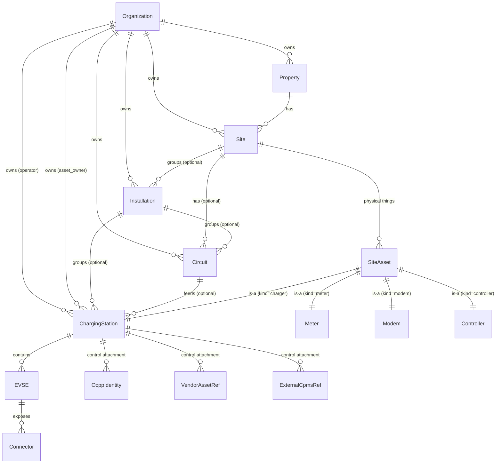
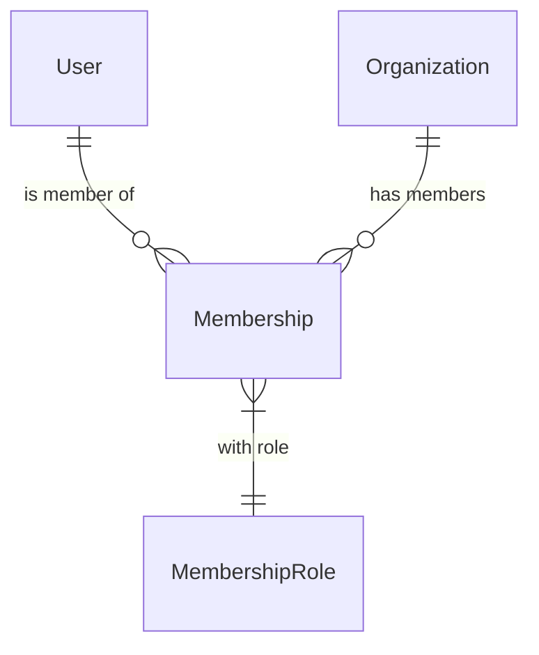
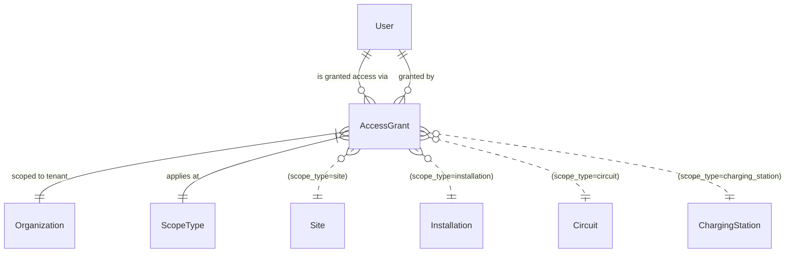

# Data model hierarchy — Org → Property → Site → Installation → Circuit → ChargingStation → EVSE → Connector

**Status:** Living doc — current Sprint 2 state. Reflects ADRs 0007, 0008, 0009, 0010, 0011, 0012.

## Tenant root and physical hierarchy

The hierarchy is a strict tree: every node has exactly one parent, and `org_id` is denormalized onto every operational table for tenant-scoping (per Rule 7 — repository functions take `orgId` as their first argument).



### Tier responsibilities

| Tier | Schema | What it represents | Cardinality |
|---|---|---|---|
| **Organization** | `tenancy.organizations` | The SaaS tenant. CPO / fleet operator / housing co-op. Carries roles[] (csms_provider, operator, retailer, dso, ...) per ADR 0010. | The root. |
| **Property** | `properties.properties` | A real-estate parcel — an address. Apartment building, business park, transit hub, depot. Attached directly to Org since [ADR 0009](../adr/0009-drop-charger-host-tier.md) dropped the ChargerHost tier. | 0..N per Org |
| **Site** | `properties.sites` | An operational location on the property. May be the whole property (single-site) or a specific zone (e.g. "South lot" of a depot). Holds the tariff anchors per ADR 0008 (DSOF/USRF/USRFPREM/XTRRF/SPVIVF). Holds `site_type` (residential/commercial/transit/...) per ADR 0009. | 1..N per Property |
| **Installation** | `properties.installations` | An optional grouping for AC vendor-managed hardware (Zaptec Pro, Easee One). The vendor portal models an installation; credentials cover the whole group. Skipped for OCPP-only chargers and DC chargers. Holds the REPF (electricity retailer) tariff anchor per ADR 0008. | 0..N per Site |
| **Circuit** | `properties.circuits` | An electrical circuit — the asset tier reintroduced by [ADR 0007](../adr/0007-circuit-asset-tier-back.md). Carries the ampere ceiling and phase count that the load-balancer schedules against. May span multiple ChargingStations (load-balanced group). Optional — chargers that aren't load-balanced have no Circuit. | 0..N per Site, optionally under an Installation |
| **ChargingStation** | `assets.charging_stations` | The physical box on the wall. Per ADR 0012 this is the unit OCPP 2.0.1 calls a "ChargingStation". For OCPP 1.6 mapping: one ChargingStation per charge-point identity. Inherits ID from a SiteAsset row (every physical asset has a SiteAsset). | 0..N per Site (or under Circuit/Installation) |
| **EVSE** | `assets.evses` | An Electric Vehicle Supply Equipment unit inside a ChargingStation. OCPP 2.0.1 native; for OCPP 1.6 stations, one EVSE per connector. Carries `max_power_kw`, `phase_count`, live status. | 1..N per ChargingStation |
| **Connector** | `assets.connectors` | A physical socket on an EVSE. Type2 / CCS2 / CHAdeMO / Schuko. Carries `connector_index`, type, max power, live status. Reservations and ChargeSessions anchor here. | 1..N per EVSE |

### Key invariants

- **Every operational row carries `org_id`.** This is the tenant scope. All repository queries filter by it (Rule 7).
- **Site is the load-bearing operational tier.** Tariff resolution, energy planning, access level (public/private/taxi_only), site_type — all anchored on Site.
- **Installation is optional.** OCPP-only chargers and DC chargers have no Installation. Don't model the absence as a special case — just leave `installation_id` null.
- **Circuit is optional.** Single-charger sites have no Circuit. Don't synthesize a one-charger Circuit.
- **ChargingStation can attach to Site directly** (via SiteAsset → Site) **or via Installation/Circuit**. The fact that Circuit and Installation both have FKs to Site means the data is consistent regardless of which path you walk.
- **Control plane is separate from physical model** ([ADR 0011](../adr/0011-control-plane-optionality.md), [ADR 0012](../adr/0012-protocol-neutral-physical-model.md)). OcppIdentity, VendorAssetRef, ExternalCpmsRef are **attachments** on ChargingStation, not the spine. A ChargingStation can have zero, one, or multiple control attachments.

### Walking the tree

Two examples of how the same fleet looks:

**Native OCPP, residential AC charger fleet (Reykjavík housing co-op):**
```
Organization "Hverfisbær"
└── Property "Hverfisgata 12"
    └── Site "Garage"
        └── Installation "Zaptec Pro install" (vendorInstallationRef populated)
            ├── Circuit "Main panel" (16A × 3-phase)
            │   ├── ChargingStation "Spot A" → EVSE 1 → Connector 1 (Type2)
            │   ├── ChargingStation "Spot B" → EVSE 1 → Connector 1 (Type2)
            │   └── ChargingStation "Spot C" → EVSE 1 → Connector 1 (Type2)
            └── (each ChargingStation has an OcppIdentity for native OCPP control)
```

**Public DC charger (transit hub):**
```
Organization "Orkuvirk"
└── Property "Esso N1 Selfoss"
    └── Site "Public charging zone" (access_level=public, site_type=transit)
        └── ChargingStation "DC150-01" (no Installation — DC fleets are flat)
            ├── EVSE 1 → Connector 1 (CCS2, 150kW)
            └── EVSE 2 → Connector 1 (CHAdeMO, 50kW)
            └── (OcppIdentity for OCPP 1.6, plus optional ExternalCpmsRef if a roaming partner imports CDRs)
```

## Access model

### Today: org-level only



`tenancy.memberships` is the single relationship between User and Organization:

| Field | Type | Notes |
|---|---|---|
| `org_id` | uuid | Composite PK with user_id |
| `user_id` | uuid | Composite PK with org_id |
| `role` | enum | owner / admin / operator / helper / contractor / driver / viewer |

A user with `role=operator` on Org X can see and act on **everything** under Org X — every Property, Site, Installation, Circuit, ChargingStation, every session, every billing line. There is no per-tier scoping today.

### Gap: no per-Installation access

The product has clear cases where org-wide access is too broad:

- A **driver** with a workplace charging contract should see only the home charger or workplace install they're entitled to, not every charger in the org.
- A **contractor** doing service work on one site should not see other sites or billing data.
- A **family member** in a workplace contract should see only the parent installation.

There is no schema today to express "user U has driver-role on installation I within org O." Every membership is org-wide.

### Proposed: AccessGrant overlay

Add an `entitlements.access_grants` table that overlays the org-level membership with narrower scopes. Membership stays as the base role; AccessGrant can grant additional access at sub-tier scopes.



**Shape:**

```prisma
model AccessGrant {
  id              String          @id @default(uuid()) @db.Uuid
  orgId           String          @map("org_id") @db.Uuid
  userId          String          @map("user_id") @db.Uuid
  scopeType       AccessScopeType @map("scope_type")
  scopeId         String          @map("scope_id") @db.Uuid
  role            AccessRole
  grantedAt       DateTime        @default(now()) @map("granted_at") @db.Timestamptz(6)
  grantedByUserId String?         @map("granted_by_user_id") @db.Uuid
  expiresAt       DateTime?       @map("expires_at") @db.Timestamptz(6)
  notes           String?         @db.Text

  @@index([orgId, userId])
  @@index([orgId, scopeType, scopeId])
  @@map("access_grants")
  @@schema("entitlements")
}

enum AccessScopeType {
  org              // equivalent to Membership; redundant if used here
  property
  site
  installation
  circuit
  charging_station

  @@schema("entitlements")
}

enum AccessRole {
  driver
  contractor
  helper
  viewer

  @@schema("entitlements")
}
```

### Resolution rule (proposed)

When the API checks "can user U see / act on resource R in org O?":

1. **Walk up R's hierarchy** to enumerate scopes — e.g. for a ChargingStation: itself, its Circuit (if any), its Installation (if any), its Site, its Property, the Org.
2. **Look up Membership(U, O)** — gives the base org-level role.
3. **Look up AccessGrant(U, O, scope_type, scope_id)** for each scope walked in step 1 — gives a narrower role for that specific resource subtree.
4. **Combine roles via precedence**: org-level membership applies broadly; AccessGrant narrows or expands at the specified tier. The most specific grant wins.
5. **Drivers are a special case**: a driver with no AccessGrant on a specific Installation/ChargingStation cannot see operational data even if they're listed as Org member. Driver role at Org level alone is insufficient — must be paired with at least one AccessGrant.

### Migration path

This is a **schema addition** — no existing data needs to move. Today's Membership-based queries continue to work. The repository layer adds an `assertCanAccess(orgId, userId, scopeType, scopeId)` helper that walks the rule above. Pages and routes that need narrower scope start using the helper; pages that don't continue with the existing `withOrgContext`.

The change is captured as **ADR 0014** when scoped (not yet written — this doc is the precursor). Sprint to land in: TBD, after Sprint 2 closes.

## Open questions

1. **Should `org` be a valid `AccessScopeType`?** Or do we leave org-level access purely to Membership, and AccessGrant only models sub-org scopes? Cleaner if we keep them disjoint: Membership for org-wide, AccessGrant for narrower.
2. **Family-group access** — drivers in a family group share access to the family's installations. Modelled via the existing `FamilyGroup` + `FamilyMembership` tables, or via AccessGrant with scope_type=installation? Probably both: family is the membership, AccessGrant is the resolved access list.
3. **Driver contracts** (per ADR 0008) already model "this user pays for this installation" via `DriverContract`. Is that the same as access, or are payment scope and read-access scope distinct? Probably distinct — a driver might see a charger they're not paying for (e.g. workplace charger, employer pays).
4. **Roaming / external drivers** — when an OCPI counterparty's driver charges at our station, they're not in our `users` table. AccessGrant doesn't apply. They get access via the OCPI token / authorization flow, not via this model.

These are deferred to the ADR.
