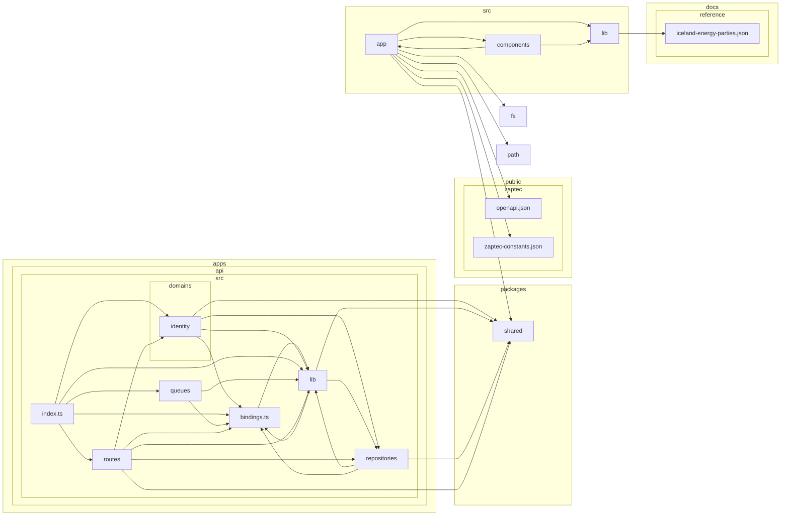

# Dependency graph — generated

**Do not edit.** Written by `scripts/gen-dependency-graph.mjs` from the
actual import graph. Regenerate with `npm run deps:graph`; `npm run check`
fails if this file is stale.

Boxes are folders, collapsed one level below each source root, so this shows
shape rather than files. Rules live in [`.dependency-cruiser.cjs`](../../.dependency-cruiser.cjs).

## Intended direction

```
  commercial ──► charging ──► assets ──► identity

  nothing may import vendor        an adapter must never appear in the core
  platform imports nothing         logs, audit, webhooks are a leaf
```

Prisma cannot express this — a relation is declared on both sides, so the
schema-level graph is necessarily symmetric. It is enforced over TypeScript
or nowhere.

## Actual



## Known violations

24 recorded in [`.dependency-cruiser-known-violations.json`](../../.dependency-cruiser-known-violations.json).

These are grandfathered, not accepted. A new one fails the build; removing
an entry is how a leak gets fixed. Adding one requires saying why.

### `no-import-from-vendor` — 22

| from | to |
|---|---|
| `apps/api/src/index.ts` | `apps/api/src/lib/zaptec-sync-cron.ts` |
| `apps/api/src/repositories/charger-technical-read.ts` | `apps/api/src/lib/credential-crypto.ts` |
| `apps/api/src/repositories/charger-technical-read.ts` | `apps/api/src/lib/zaptec.ts` |
| `apps/api/src/repositories/charger-zaptec-config.ts` | `apps/api/src/lib/credential-crypto.ts` |
| `apps/api/src/repositories/charger-zaptec-config.ts` | `apps/api/src/lib/zaptec.ts` |
| `apps/api/src/repositories/chargers.ts` | `apps/api/src/lib/zaptec.ts` |
| `apps/api/src/repositories/chargers.ts` | `apps/api/src/repositories/credential-management.ts` |
| `apps/api/src/repositories/site-tree.ts` | `apps/api/src/lib/credential-crypto.ts` |
| `apps/api/src/repositories/site-tree.ts` | `apps/api/src/lib/zaptec.ts` |
| `apps/api/src/routes/admin/groups.ts` | `apps/api/src/repositories/vendor-user-groups.ts` |
| `apps/api/src/routes/admin/vendor-credentials.ts` | `apps/api/src/lib/zaptec.ts` |
| `apps/api/src/routes/admin/vendor-credentials.ts` | `apps/api/src/repositories/credential-management.ts` |
| `apps/api/src/routes/admin/vendor-credentials.ts` | `apps/api/src/repositories/vendor-credential-probe.ts` |
| `apps/api/src/routes/admin/vendor-credentials.ts` | `apps/api/src/repositories/vendor-credentials.ts` |
| `apps/api/src/routes/admin/vendor-credentials.ts` | `apps/api/src/repositories/zaptec-session-probe.ts` |
| `apps/api/src/routes/admin/vendor-credentials.ts` | `apps/api/src/repositories/zaptec-session-sync.ts` |
| `apps/api/src/routes/admin/zaptec.ts` | `apps/api/src/lib/zaptec.ts` |
| `apps/api/src/routes/admin/zaptec.ts` | `apps/api/src/repositories/vendor-credentials.ts` |
| `apps/api/src/routes/admin/zaptec.ts` | `apps/api/src/repositories/zaptec-bulk-config.ts` |
| `apps/api/src/routes/admin/zaptec.ts` | `apps/api/src/repositories/zaptec-import.ts` |
| `apps/api/src/routes/internal/zaptec-trigger-sync.ts` | `apps/api/src/repositories/credential-management.ts` |
| `apps/api/src/routes/internal/zaptec-trigger-sync.ts` | `apps/api/src/repositories/zaptec-session-sync.ts` |

### `no-circular` — 1

| from | to |
|---|---|
| `src/app/(app)/accounts/organizations/[id]/email-domains/email-domains-panel.tsx` | `src/app/(app)/accounts/organizations/[id]/email-domains/page.tsx` |

### `no-identity-to-higher-layer` — 1

| from | to |
|---|---|
| `apps/api/src/domains/identity/routes/admin-users.ts` | `apps/api/src/repositories/agreements.ts` |

